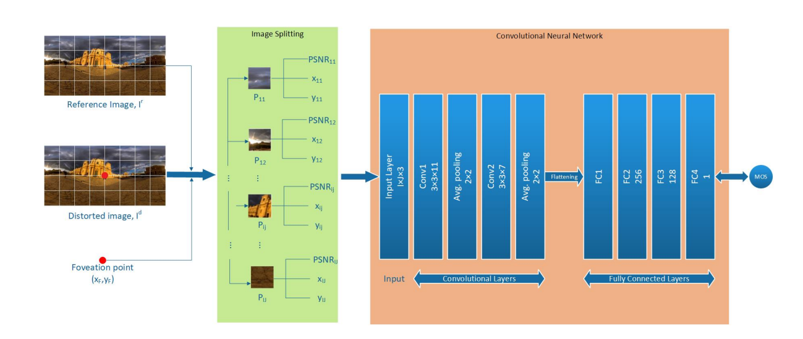
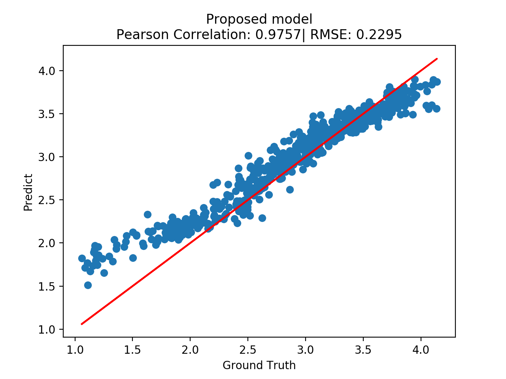

<h3> # Omnidirectional_Images_Assessment </h3>
<h4> Omnidirectional Images Assessment </h4>

 In this project, I start to research on the Omnidirectional (ˌämniˌdiˈrekSHənl - 3D) Images and how to assess them by Machine Learning and make them as the same result as human perspective 

There are two phases:  
**First phase**: Pre-processing: Image spliting, PSNR calculating, position of each patch calculate, etc. 
**Second phase**: Apply deep learning to predict MOS of image base on data has been processed on the first phase

**Model Architect**: This network architecture consists of two main
parts: convolutional layers and fully connected layers. For
convolutional layers, the input matrix of size **I×J×3** initially
goes through the first convolutional layer with **11** **3×3 filters**
and a stride of **1**. After passing through the first convolutional
layer **1** and average pooling of **2×2**, the intermediate outputs
are fed into a second convolutional layer with **7 3×3 filters**
with a stride of **1**. The outputs after the second convolutional
layer then go through the second concatenated pooling layer
of **2×2** kernel with a stride of **1** to generate a feature map of
the input image patches.

**Fig**. Architecture of the proposed **Omni-IQA model**. The input of the model includes a distorted image, reference image, and the position of foveation
point. In the image splitting part, the distorted image is divided into **64x64 patches**. Every single patch contains 3 features: **PSNR**, **relative distance with the
foveation point**. All of the information of all of the patches will be the input for the next part - ConvNet to predict the MOS of image.

**Result**: Below is the best training result based on the dataset of 512 Omnidirectional images.

The Pearson Correlation at **0.9757**, demonstrates the model predicted results correlate to the human manual evaluation (ground truth) at **97.57%**

